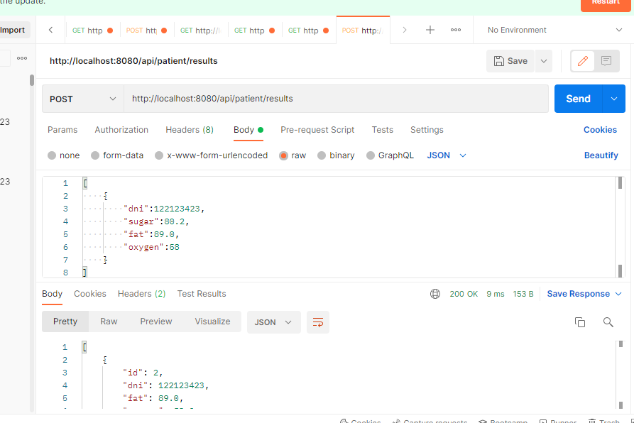
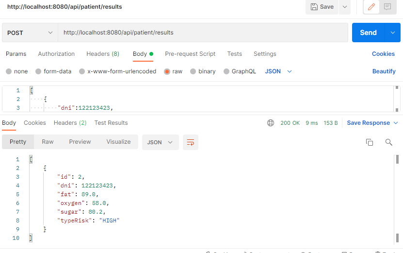
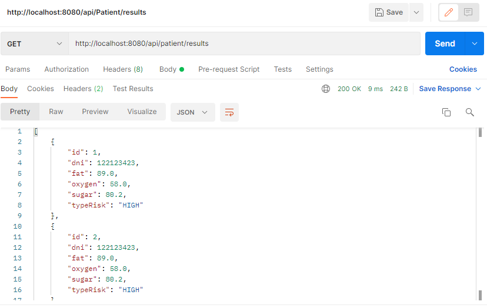
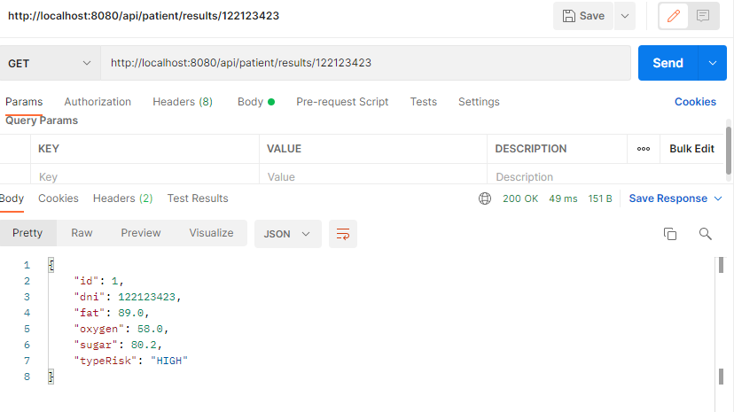

# pruebaI4digital
Se realiza prueba para empresea I4digital

Los servicios desarrollados fueron los siguientes

## Registrar los resultados y obtener el riesgo 

Post http://localhost:8080/api/patient/results

body Request
```json
[
    {
        "dni":122123423,
        "sugar":80.2,
        "fat":89.0,
        "oxygen":58
    }
]
```

reponse
```json
[
    {
        "id": 1,
        "dni": 122123423,
        "fat": 89.0,
        "oxygen": 58.0,
        "sugar": 80.2,
        "typeRisk": "HIGH"
    }
]
```

## Ejemplo:






## Traer todos los resultados con su riesgo 

GET: http://localhost:8080/api/patient/results

reponse:

```json
[
    {
        "id": 1,
        "dni": 122123423,
        "fat": 89.0,
        "oxygen": 58.0,
        "sugar": 80.2,
        "typeRisk": "HIGH"
    }
]
```
## Ejemplo:




## Traer riesgo específico con el dni del paciente

GET: http://localhost:8080/api/patient/results/{dni}

reponse
```json
{
    "id": 1,
    "dni": 122123423,
    "fat": 89.0,
    "oxygen": 58.0,
    "sugar": 80.2,
    "typeRisk": "HIGH"
}
```

## Ejemplo:




